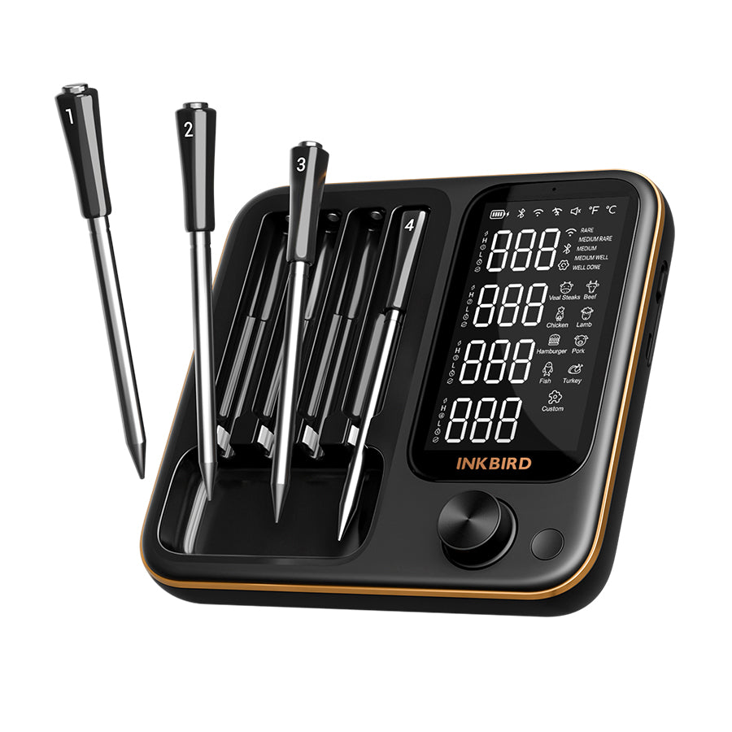
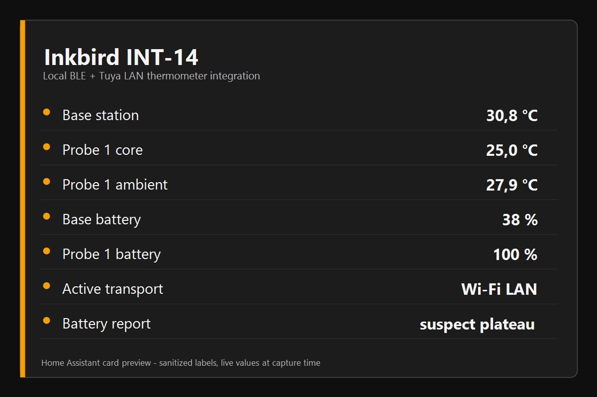

# Inkbird INT for Home Assistant

Home Assistant custom integration for the modern Inkbird INT food thermometer family.

INT-14-BW is the tested baseline. Related INT-14, INT-12, INT-31, INT-33 and selected INT-11 profiles are exposed as experimental or cataloged until validated by real hardware reports.

[](https://my.home-assistant.io/redirect/hacs_repository/?owner=zampix1&repository=ha-inkbird-int14&category=integration)

<p align="center">
  <a href="https://www.buymeacoffee.com/zampix1">
    
  </a>
</p>

If this project helps you, leaving a star or buying me a coffee is appreciated.

This project is not affiliated with, endorsed by or supported by Inkbird.

<p align="center">
  
  
</p>

Product image is included only as a device reference. Inkbird names, logos and trademarks belong to their respective owners.

## What Works

- Tested with an Inkbird INT-14-BW station as the baseline device.
- Includes experimental and cataloged profiles for related INT-14, INT-12, INT-31, INT-33 and INT-11 family models.
- Installable as a HACS custom repository or by manual copy.
- Local BLE is used for discovery, snapshots and explicit BLE commands.
- Local Tuya LAN is used for station polling and supported writes when the user supplies their own host, device ID and local key.
- Optional cloud history is read-only and limited to DP109 temperature history.
- Exposes mapped probe temperatures, station temperature, target values, transport status, local availability and selected battery/state indicators for supported profiles.
- INT-11I-B has experimental read-only BLE GATT-poll support for one probe temperature and base/probe battery from a community validation report.
- Models with multi-sensor probes are represented with their expected physical-probe and temperature-channel layout, but live entities are created only for channels mapped by the current parser.

## Status

Public HACS custom repository release for testers with INT family hardware. INT-14-BW is validated; other profiles are experimental or cataloged and need hardware feedback.

Repository:

```text
https://github.com/zampix1/ha-inkbird-int14
```

## Repository Name

The repository is still named `ha-inkbird-int14` for continuity with the original INT-14-BW implementation, existing links, HACS custom repository installs and public discussions.

The public integration name is now `Inkbird INT`, because the codebase has been extended with model profiles for related modern INT food thermometer models.

The integration is hybrid/local-first:

- Local BLE for discovery, snapshots and explicit BLE commands.
- Local Tuya LAN for station polling and supported writes when the user supplies host, device ID and local key.
- Optional experimental cloud history for DP109 temperature history only.

Cloud live updates and cloud writes are not supported.

## Requirements

- Home Assistant with Bluetooth enabled for BLE mode and BLE snapshots.
- Inkbird INT-14-BW as tested baseline, or a related experimental/cataloged INT model profile listed in `docs/model_profiles.md`.
- Optional Tuya LAN credentials supplied by the user:
  - station host or IP;
  - device ID;
  - local key;
  - protocol version, usually `3.5`.
- Optional cloud history credentials supplied by the user for read-only DP109 history.
- Optional ESPHome Bluetooth Proxy when the Home Assistant Bluetooth adapter is far from the station.

## Installation With HACS

1. Open HACS.
2. Add this repository as a custom repository.
3. Select category `Integration`.
4. Install the integration.
5. Restart Home Assistant.
6. Add `Inkbird INT` from **Settings > Devices & services**, then select the model profile that matches your device.

Repository URL:

```text
https://github.com/zampix1/ha-inkbird-int14
```

## Manual Installation

1. Copy `custom_components/inkbird_int14` into the Home Assistant `custom_components/` directory.
2. Restart Home Assistant.
3. Go to `Settings -> Devices & services -> Add integration`.
4. Search for `Inkbird INT`.

## Configuration

The config flow asks for:

- BLE address of the INT-14 station;
- display name;
- model profile;
- transport mode;
- optional Tuya LAN host, device ID, local key, protocol version, port and poll interval;
- optional Tuya LAN test before saving.

Advanced options include the same LAN fields plus optional experimental cloud history fields.

Cloud history is disabled by default. It is read-only and only polls Inkbird history DP109.

## Simple Wi-Fi LAN Setup

For local Wi-Fi polling, the station must already be connected to your network. Then provide these values in the integration setup or options:

| Field | What to enter |
| --- | --- |
| Host or IP | The station address on your LAN. A fixed DHCP reservation is recommended. |
| Device ID | The Tuya device ID for your own station. This is not the model name. |
| Local key | The per-device Tuya local key. This is not your Wi-Fi password and not your Inkbird password. |
| Protocol version | Usually `3.5` for the tested INT-14-BW station. |
| Poll interval | Start with `10` seconds unless you have a reason to change it. |

This integration does not retrieve the local key for you. Use a Tuya/local-key method you trust for your own device, then paste the resulting device ID and local key into Home Assistant. If you already use LocalTuya, TinyTuya or another Tuya LAN tool for the same station, these are the same kind of values. If the station is reset or re-paired, the local key may change.

After saving, keep transport mode on `Auto` for normal operation. Use `Wi-Fi LAN only` only for troubleshooting. Useful LAN diagnostics are `Local LAN Configured`, `Local LAN Available`, `Local LAN Status OK`, `Local LAN Update OK` and `Last LAN Update Epoch`.

### Getting Device ID And Local Key

This integration does not collect Tuya cloud credentials. It only needs the final local values for your own station.

Practical routes:

- If the station is already configured in LocalTuya, Tuya Local or another Tuya LAN tool, reuse the same IP/host, device ID, local key and protocol version.
- TinyTuya can scan the LAN and run `python -m tinytuya wizard`; the generated `devices.json` contains fields such as `id`, `key`, `ip` and `version`.
- The Tuya IoT developer portal can expose the same values after linking the app account that owns the device, then using API Explorer device details queries.

Do not upload `devices.json`, Tuya API credentials, device IDs or local keys to public issues. Use placeholders when asking for help.

More detail: `docs/lan_setup.md`.

## Transport Modes

`Auto` prefers Tuya LAN when a complete LAN configuration is available. It avoids keeping BLE connected continuously when LAN is working.

`BLE only` uses Home Assistant Bluetooth for local snapshots and supported BLE commands.

BLE sessions perform the local challenge/response authentication before snapshots and command readback. The auth helper is adapted from the MIT-licensed [`paul43210/inkbird-bw-ble`](https://github.com/paul43210/inkbird-bw-ble) work, while this integration remains a native Home Assistant custom integration with Tuya LAN and optional history support.

`BLE only` can be selected explicitly even while the station remains connected to Wi-Fi. This is useful for one-shot GATT snapshots or local BLE writes without changing the station's network setup. Switch back to `Auto` for steady-state LAN polling.

`Wi-Fi LAN only` uses the local Tuya protocol through `tinytuya`. It requires host, device ID and local key supplied by the user.

`Wi-Fi cloud only` uses optional cloud history polling for DP109. It is experimental, read-only and does not support live cloud data or cloud writes.

## Entities

Main entities are enabled by default:

- mapped probe temperature channels for the configured model profile;
- base station temperature;
- target high/low values when available;
- display light and temperature unit;
- transport status;
- Tuya LAN availability/status;
- selected battery/state indicators.

Noisy raw diagnostics and fragile fields that are often unknown are marked diagnostic and many are disabled by default.

The profile diagnostics include physical probe count, expected temperature channel count and mapped live temperature channel count. Cataloged profiles with no validated parser mapping do not create placeholder temperature entities for every expected channel.

Battery values remain numeric when a fresh INT-14 battery snapshot exists. Repeated 100% probe reports are flagged through `Battery Report Quality` and suspect binary sensors instead of hiding the battery value. Local testing showed that the station can still report all probe batteries as 100% after successful BLE authentication, so those values should be treated as station-reported rather than independently verified probe fuel gauges.

See `docs/model_profiles.md` for the tested or experimental status of each profile.

## Model Validation Reports

If you test a related INT model, start with a sanitized GitHub Discussion unless you already have a reproducible bug:

- Discussion: <https://github.com/zampix1/ha-inkbird-int14/discussions/new?category=q-a>
- Issue form: <https://github.com/zampix1/ha-inkbird-int14/issues/new?template=model_validation_report.yml>

The templates ask for model/profile, transport path, readings, writes and redacted diagnostics. Do not include real BLE addresses, LAN IPs, device IDs, local keys, tokens, Wi-Fi names, screenshots with private data or Home Assistant entity IDs.

For multi-sensor probes, include how many physical probes the app shows, how many temperature channels it shows and which app channel changes when you heat the tip, middle and ambient section of a probe.

For ordinary setup questions use Discussions. For reproducible integration bugs use Issues:

- Support/setup: <https://github.com/zampix1/ha-inkbird-int14/discussions/new?category=general>
- Bug report: <https://github.com/zampix1/ha-inkbird-int14/issues/new?template=bug_report.yml>
- Feature request: <https://github.com/zampix1/ha-inkbird-int14/issues/new?template=feature_request.yml>

## Writes

Supported local writes use Tuya LAN when configured and fall back to BLE only when the selected transport allows BLE:

- unit;
- display light;
- target temperature;
- pre-alarm;
- timer and timer reset;
- calibration.

Cloud writes are not supported.

## Services

The public service surface contains named local operations only. It does not expose raw BLE payload writes or external DP injection.

See `custom_components/inkbird_int14/services.yaml`.

## Documentation

- `docs/lan_setup.md`
- `docs/model_profiles.md`
- `docs/cloud_history_experimental.md`
- `docs/bluetooth_proxy.md`

## Privacy And Security

The repository must not contain real BLE addresses, local keys, device IDs, cloud API credentials, LAN IP addresses, screenshots, local paths or Home Assistant entity IDs.

Diagnostics redact common credential and identifier keys.

BLE authentication code includes MIT-licensed portions adapted from [`paul43210/inkbird-bw-ble`](https://github.com/paul43210/inkbird-bw-ble). See `THIRD_PARTY_NOTICES.md`.

When opening public issues, replace private values with placeholders such as:

```text
AA:BB:CC:DD:EE:FF
192.0.2.10
example-device-id
example-local-key
```

## Known Limits

- A complete local Tuya LAN setup requires the user's own local key.
- Tuya LAN polling may not always emit every DP needed for complete battery/state data.
- BLE snapshots for battery/state are opportunistic and depend on Bluetooth reachability. Forced `BLE only` mode can still work while Wi-Fi is connected, but the station may limit BLE availability depending on firmware state and radio range.
- Battery percentage is the value reported by the station. Use the diagnostic quality/suspect entities when the station reports repeated 100% probe values.
- Cloud history covers DP109 temperature history only.
- Cloud live data, cloud battery/state and cloud writes are not supported.
- Non-INT-14 and multi-sensor profiles are experimental or cataloged until hardware captures confirm their parser and write behavior.
- Cataloged multi-sensor profiles may show an expected channel layout without exposing live temperature entities.

## Alternatives

Before using a custom integration, check whether Home Assistant core or another maintained integration already supports your exact Inkbird model.
