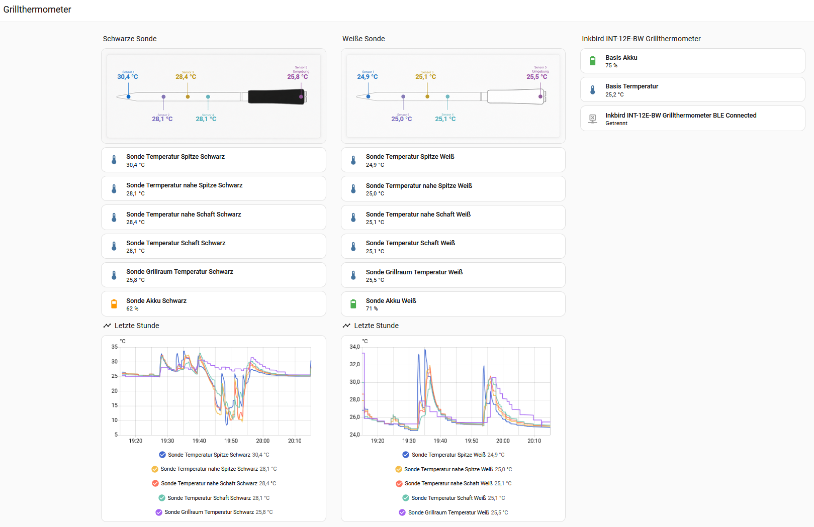

# INT-12E-BW Community Dashboard

This optional Lovelace example turns the five temperature channels from each INT-12E-BW probe into a more readable probe view.



The example was shared by [@Nexus1212](https://github.com/Nexus1212) in [Discussion #3](https://github.com/zampix1/ha-inkbird-int14/discussions/3#discussioncomment-17664834). It is a dashboard example, not a card installed automatically by the integration.

## Included Files

- [`examples/int12e_probe_dashboard.yaml`](examples/int12e_probe_dashboard.yaml): sanitized one-probe card.
- [`images/community/int12e-probe-black.png`](images/community/int12e-probe-black.png): black probe background.
- [`images/community/int12e-probe-white.png`](images/community/int12e-probe-white.png): white probe background.

## Set It Up

1. Download one or both probe images.
2. Put them in `/config/www/` on Home Assistant:

```text
/config/www/int12e-probe-black.png
/config/www/int12e-probe-white.png
```

3. Add a manual card to a dashboard and paste the example YAML.
4. Replace every `sensor.example_int12e_...` entity ID with the entity ID from your own Home Assistant installation.
5. Duplicate the card for probe 2, change `probe_1` to `probe_2`, and use `/local/int12e-probe-white.png` if wanted.

The example uses only standard Home Assistant cards. No custom frontend card is required.

## Channel Placement

The contributor's layout uses this visual order:

| Probe label | Integration channel | Position shown |
| --- | --- | --- |
| Sensor 1 | Food 4 | tip |
| Sensor 2 | Food 1 | near tip |
| Sensor 3 | Food 3 | middle |
| Sensor 4 | Food 2 | near handle |
| Sensor 5 | Ambient | handle/ambient |

Food 4 has been confirmed as the tip channel on both physical probes. The remaining Food 1-3 positions currently follow the community dashboard layout and should not yet be treated as a completed controlled physical mapping.

The screenshot and probe artwork are reproduced from the linked community post with identifying entity IDs removed from the reusable YAML.
